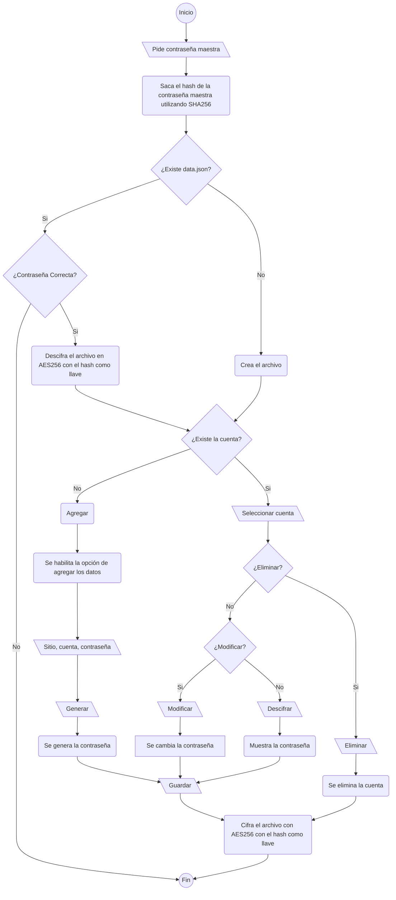

# Password Manager V2

 Una aplicación de escritorio para administrar las cuentas y contraseñas de diferentes sitios de manera segura. 

### Contenidos

- [Instalación](#instalación)
- [Overview](#overview)
- [Uso](#uso)
- [Cambios respecto a Password Manager V1](#cambios-respecto-a-password-manager-v1)
- [Siguientes pasos](#siguientes-pasos)

### Instalación

Primero se requiere instalar `node.js` y `npm`. Una vez hecho eso se usan los siguientes comandos para descargar el proyecto.

```batch
git clone https://github.com/Cracop/PasswordManagerv2.git
cd PasswordManagerv2
npm init
npm install
```

Para ejecutar el programa se utiliza el siguiente comando dentro de la carpeta que contiene los archivos del proyecto: `npm start`

### Overview


### Uso

1) Al correr el comando `npm start`, se mostrará la siguiente ventana:


2) Al darle clic en `Acceder` se presentará la siguiente entrada:


3) 
- Si la aplicación no se ha utilizado previamente, es decir no existe un archivo llamado `data.json`, la contraseña que se le dé será la contraseña con la cual se cifrará la información de ese momento en adelante. 
- De haberse utilizado anteriormente, se deberá introducir la contraseña que se utilizó la primera vez. Si no se tiene la contraseña original, con borrar el archivo `data.json` la aplicación regresará a su estado original. 


4) Una vez dentro de la aplicación se mostrarán las cuentas que se han guardado en forma de tabla, así como un botón que permite agregar una nueva cuenta. 


5) Al hacerle clic a al botón de `Agregar` se presentan los siguentes campos. El botón de `Generar` presenta sugerencia de una contraseña segura. 


6) Al darle click en `Guardar`se actualizará nuestra tabla de cuentas


7) Para modificar o ver la contraseña de una cuenta creada previamente basta con solo darle click en la tabla, esto nos mostrará de nuevo las opciones que vimos al crear la cuenta. Para ver la contraseña, se debe de dar click en `Descifrar`.


8) Si se desea cambiar la contraseña con la cual se cifra la información, solo se necesita hacer click en `Cambiar Contraseña Maestra` e introducir la nueva contraseña.


### Cambios respecto a Password Manager V1

Previamente la aplicación utilizaba Python como backend para el cifrado y descifrado de la información, así como que se utilizaba *vanilla* JavaScript.

Para este proyecto se utilizó únicamente JavaScript para poder facilitar el desarrollo. De igual manera se utilizó la librería [JQuery](https://jquery.com/) con el objetivo de presentar una aplicación de mayor calidad. 

### Siguientes pasos

Para el Password Manager V3 se planea convertir el proyecto en un aplicacion web completa utilizando el stack MEVN ([MongoDB](https://www.mongodb.com/), [Express.js](https://expressjs.com/), [Vue.js](https://vuejs.org/), Node.js). 
