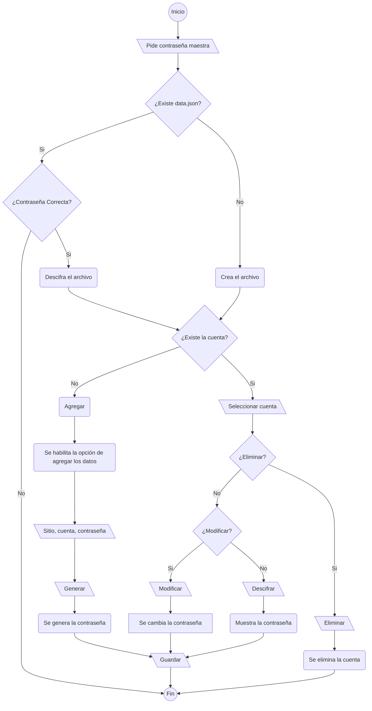

# Password Manager V2

### Contenidos

- [Acerca del proyecto](#acerca-del-proyecto)
- [Instalación](#instalación)
- [Uso](#uso)
- [Funcionamiento](#funcionamiento)
- [Cambios respecto a Password Manager V1](#cambios-respecto-a-password-manager-v1)
- [Futuro](#futuro)

### Acerca del Proyecto

Se trata de una aplicación de escritorio para administrar las cuentas y contraseñas de diferentes sitios de manera segura. 

### Instalación

Se requiere haber instalado previamente `node.js` y `npm`

```batch
git clone https://github.com/Cracop/PasswordManagerv2.git
cd PasswordManagerv2
npm init
npm install
```

Para correr el programa se utiliza el siguiente comando dentro de la carpeta que contiene los archivos del proyecto: `npm start`

### Uso

Al correr el comando `npm start`, se mostrará la siguiente ventana


Al darle click en `Acceder` se presentará la siguiente dialog box:


- Si la aplicación no se ha utilizado previamente (no existe un archivo llamado `data.json`), la contraseña que se le dé será la contraseña con la cual se cifrará la información de ese momento en adelante. 
- De haberse utilizado anteriormente, se deberá introducir la contraseña que se utilizó la primera vez. Si no se tiene la contraseña original, con borrar el archivo `data.json` la aplicación regresará a su estado original. 

Ya una vez dentro de la aplicación se mostrarán las cuentas que se han guardado en forma de tabla, así como un botón que permite agregar una nueva cuenta. 


Al hacerle click a al botón de `Agregar` se presentan los siguentes campos. El botón de `Generar` presenta sugerencia de una contraseña segura. 


Al darle click en `Guardar`se actualizará nuestra tabla de cuentas


Para modificar o ver la contraseña de una cuenta creada previamente basta con solo darle click en la tabla, esto nos mostrará de nuevo las opciones que vimos al crear la cuenta. Para ver la contraseña, se debe de dar click en `Descifrar`.


Si se desea cambiar la contraseña con la cual se cifra la información, solo se necesita hacer click en `Cambiar Contraseña Maestra` e introducir la nueva contraseña.


### Funcionamiento

Se



### Cambios respecto a Password Manager V1

Previamente la aplicación utilizaba Python como backend para el cifrado y descifrado de la información, así como que se utilizaba vanilla JavaScript.

Para este proyecto se utilizó únicamente JavaScript para poder facilitar el desarrollo. De igual manera se utilizó la librería [JQuery](https://jquery.com/) con el objetivo de presentar una aplicación de mucho mayor calidad. 

### Futuro

Para el Password Manager V3 se planea convertir el proyecto en un aplicacion web completa utilizando el stack MEVN ([MongoDB](https://www.mongodb.com/), [Express.js](https://expressjs.com/), [Vue.js](https://vuejs.org/), [Node.js]()). 
